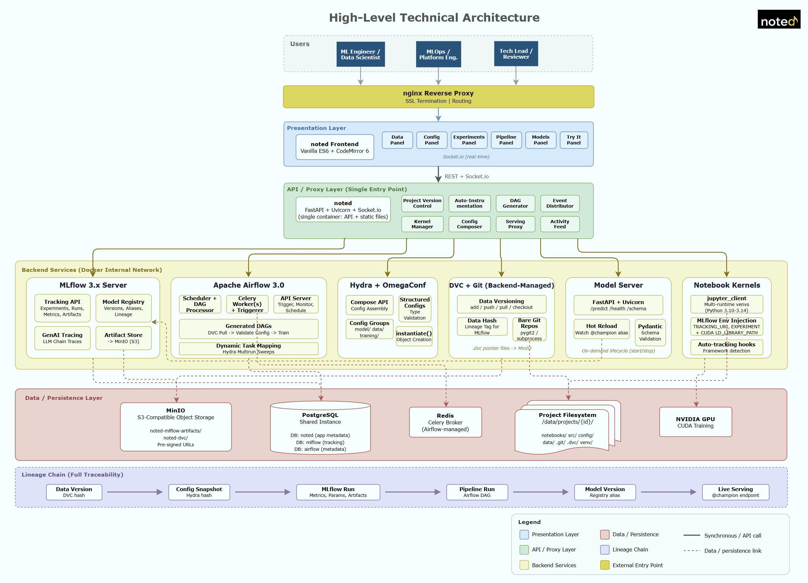

# noted



An integrated MLOps platform that unifies interactive notebooks, data versioning, experiment tracking, configuration management, pipeline orchestration, and model serving in a single collaborative web interface.

The underlying tools — MLflow, DVC, Hydra, Apache Airflow, MinIO — remain the engines. **noted is the cockpit.**

---

## The Problem

Building machine learning models requires operating across a fragmented landscape of tools, each with its own interface and mental model:

- **Notebooks** for interactive exploration — but no built-in versioning, tracking, or reproducibility
- **MLflow** for experiment tracking — but requires switching to a separate UI to inspect runs, compare metrics, or browse artifacts
- **DVC** for data versioning — but lives in the terminal, invisible to the notebook workflow
- **Hydra** for configuration management — but configs are scattered YAML files with no visual composition or validation
- **Airflow** for pipeline orchestration — but requires a separate UI to trigger, monitor, and debug DAGs
- **MinIO / S3** for artifact storage — but accessed through yet another console

Practitioners spend significant time context-switching between browser tabs, terminals, and dashboards. Configuration drift between what was experimented with and what gets deployed is a persistent source of production failures. There is no unified interface that lets a practitioner go from raw data to deployed model within a single, coherent experience while maintaining full traceability.

**noted eliminates the context-switching.** Every step of the ML lifecycle — data ingestion, versioning, configuration, training, tracking, evaluation, orchestration, model governance, and serving — happens inside one application.

**Zero vendor lock-in.** Every artifact noted creates works without noted. Notebooks are standard `.ipynb`. MLflow runs are standard MLflow runs. DVC tracking uses standard `.dvc` files. Hydra configs are standard YAML. Airflow DAGs use only standard operators. If you uninstall noted tomorrow, your entire MLOps stack continues to run.

---

## Key Features

### Interactive Notebooks

- Jupyter-compatible notebook editor powered by CodeMirror 6
- Real-time multi-user collaboration with cell-level locking and live presence via Socket.IO
- Multi-runtime support: Python 3.10-3.14 including free-threaded (nogil) variants, JavaScript/Node.js via IJavascript kernel, R 3.6.3 / 4.0.5 / 4.2.3 / 4.3.3 / 4.4.2 / 4.5.1 (modern R via Posit's ark kernel, legacy R via IRkernel)
- GPU acceleration with CUDA runtime for PyTorch, TensorFlow, and other frameworks
- Markdown cells with LaTeX math rendering (KaTeX)
- Standard `.ipynb` import/export — fully compatible with Jupyter

### Code Intelligence (LSP)

- **7 supported languages**: Python, JavaScript, R, HTML, CSS, JSON, YAML - all with syntax highlighting, auto-completion, documentation, and linting
- Ruff linting for Python files and notebook cells via Jupytext shadow files
- Jedi language server for Python autocomplete, hover documentation, and go-to-definition
- Biome linting for JavaScript files and notebook cells with category-based severity (error/warning/info mapped from lint, style, complexity, performance categories)
- typescript-language-server for JavaScript autocomplete, hover documentation, and go-to-definition
- **R languageserver** (REditorSupport) for R `.R` files and R notebook cells: completion, hover docs, lintr-driven diagnostics. Modern R (4.2-4.5) gets the latest CRAN release; legacy R (3.6.3, 4.0.5) gets era-matched binaries from Posit Public Package Manager snapshots (2020-04-01 / 2021-05-01) — all 6 R versions are first-class with full LSP
- **`RENV_CONFIG_EXTERNAL_LIBRARIES`** hook lets the LSP see system-installed languageserver from inside renv-isolated R envs without polluting the user's renv lockfile
- vscode-langservers-extracted for HTML, CSS, and JSON: auto-completion, hover documentation, and linting/validation
- yaml-language-server (Red Hat) for YAML completion, schema validation, and hover docs (Hydra config files, GitHub Actions workflows, docker-compose, etc.)
- Severity remapping - Ruff reports everything as Error; backend remaps to Error/Warning/Info based on rule prefix
- Documentation panel in right pane - hover documentation rendered in a dedicated panel instead of inline tooltips, docstrings rendered with docutils reST-to-HTML, Water.css styling
- VS Code-style completion icons - SVG icons in autocomplete dropdown matching VS Code's visual language (method, property, variable, class, etc.)
- Code minimap for file editor with lint severity color markers
- Code Problems panel - bottom status bar pill shows error/warning counts, click opens sortable diagnostics panel
- Lint fix for notebooks - shared EditorView registry, fix approval panel with diff preview for both files and cells
- File editor: Tab inserts 4 spaces, Ctrl+Home/End navigate to start/end of file
- Project default venv persisted in `.noted/settings.json` per project

### Debugging (DAP)

- **Notebook debugging**: set breakpoints in cells, debug with stepping and variable inspection via ipykernel's built-in Debugger
- **File debugging**: breakpoints and Run/Debug dropdown for `.py` files, `%run -i` execution through kernel
- **Breakpoint gutter**: CodeMirror extension with red dot markers, click to toggle
- **Debug toolbar**: Continue (F5), Step Over (F10), Step In (F11), Step Out (Shift+F11), Stop (Shift+F5)
- **Debug panel** in right pane: Variables section with lazy expansion, Call Stack with navigable frames, Breakpoints with enable/disable/delete
- **Run mode dropdown**: chevron next to play button to switch between Run and Debug mode
- **Current line highlight**: gold background on the paused line
- **Cross-file navigation**: click stack frame to open file and jump to line
- **Smart continue**: checks for remaining breakpoints before terminating; auto-continue on last line prevents IOStream flush timeout
- **Execution error forwarding**: ModuleNotFoundError etc. shown as notifications
- **Debug All Cells**: concatenates all code cells into a shadow file (`/tmp/noted_debug_<hash>.py`) with `# %%` markers, enabling cross-cell breakpoints and cell-boundary stepping (F10 at end of cell auto-advances to next)
- **Filename injection**: `compile(code, shadow_path, 'exec')` makes debugpy see one unified file while cells execute individually via `kc.execute()` - per-cell output (charts, prints) preserved
- **IPython-safe wrapper**: `transform_cell` for magics, `ast.Interactive` for display hook - charts and dataframes render correctly during debug
- **Live breakpoint updates**: adding/removing breakpoints during an active debug session re-sends to the debugger immediately
- **Run menu**: menu bar entry with Run Cell, Run All, Debug Cell, Continue, Step Over, Step In, Step Out, Stop, Toggle Breakpoint - all with keyboard shortcuts
- **Debug icon**: red bug icon in icon bar toggles the Debug panel in the right pane
- **Debug status pill**: red pill in status bar during active debug sessions, clickable
- **Step throttling**: prevents rapid F10 from losing gold line tracking
- **Combined breakpoint+arrow marker**: red arrow with rounded left edge when paused at a breakpoint line
- **Debug stop cleanup**: control thread deadlock fix - continue + disconnect sent via dispatcher before stopping event task, with kernel restart fallback
- **JavaScript file debugging**: terminal-based file debug via vscode-js-debug - runInTerminal pattern shows output inline for `.js` files, matching Python file debug UX
- **Terminal-based file debug**: both Python (debugpy) and JavaScript (vscode-js-debug) use runInTerminal for file execution, with live output in embedded terminal

### Environment Management

- Create isolated virtual environments per Python runtime
- Install and uninstall packages from the UI with live terminal output (`uv` or `pip`)
- Project-scoped and shared environments
- MLflow and DVC auto-installed in new environments
- fnm (Fast Node Manager) for Node.js version management (Node 20 LTS, 22 LTS)
- pnpm for JavaScript package management with PTY streaming output in the UI
- **renv** for R environment isolation, one renv project per noted R env, with the per-env library + lockfile redirected to noted-managed paths via `RENV_PATHS_LIBRARY` / `RENV_PATHS_LOCKFILE` (Option E architecture: cwd = project_root, R_PROFILE_USER points at a noted-managed `.Rprofile` that calls `renv::load`)
- Language grouping: Python, JavaScript, and R environments shown as sub-nodes under "Environments" with VS Code-style color SVG icons

### Experiment Tracking (MLflow)

- **Zero-config MLflow connectivity**: `MLFLOW_TRACKING_URI` injected into every kernel automatically — `import mlflow` just works. Experiment names are managed by Run Manager or set explicitly by user code
- **Experiments browser**: browse experiments and runs directly in the workspace tree with status icons, metrics, parameters, and tags
- **Run Manager**: define named cell groups as reusable run templates. Assign cells to runs via visual badges, or use "Select All" to include every code cell in one click. Execute all assigned cells sequentially, wrapped in a single MLflow run with automatic `start_run`/`end_run` injection. One click, one experiment run - no boilerplate. Framework autologging (PyTorch, scikit-learn, TensorFlow, XGBoost, LightGBM) activated automatically at run end
- **Artifact browser**: browse run artifacts inline — images rendered as thumbnails, interactive HTML charts (Plotly) in sandboxed iframes, model cards for PyTorch, Prophet, sklearn, and other MLflow flavors
- **Run comparison**: compare any two runs side by side in a dedicated panel - metrics diff table with delta and percentage, parameter diff table, tags diff, and overlaid metric history charts. Differing values highlighted for quick identification
- **Live metrics streaming**: watch loss curves and accuracy update in real time during training via Socket.IO
- **Run lifecycle**: stop runs (marks as KILLED), delete runs, delete experiments — from context menus or detail panels
- **Register Model from run**: one-click model registration from any finished run's detail page
- **Load Model in notebook**: brain icon in notebook bar opens a modal to select any registered model and version, inserts predict boilerplate code
- **DVC hash traceability**: every run is automatically tagged with the current data version hash, linking models to the exact dataset that produced them

### Data Versioning (DVC + MinIO)

- **Built-in DVC remote**: MinIO runs as part of the stack — `dvc push` and `dvc pull` work immediately with zero configuration
- **Track from the UI**: right-click any data file → "Track with DVC". The backend runs `dvc add`, `dvc push`, and commits the pointer file to Git
- **Version history**: browse tracked file versions with hashes, sizes, and timestamps. Switch between versions with one-click checkout
- **Data section in Explorer**: dedicated tree view aggregates all DVC-tracked files across projects and mounts. Click a file to see its metadata (size, hash, source) and full version history with checkout buttons
- **Git + DVC status decorations**: VS Code-style colored dots and status badges on every file in the workspace tree — modified, added, untracked, DVC-tracked
- **Terminal escape hatch**: when Git or DVC operations fail in complex ways (merge conflicts, lock contention), a toast notification offers an "Open Terminal" button that drops into the project directory — no need for a complex conflict resolution UI
- **File upload**: upload any file to a project or mount directory via Explorer title bar, File menu, or context menu. Auth-gated with the same access key as the terminal. Multi-file support, 500MB limit
- **Storage browser**: browse MinIO buckets and objects directly in the workspace tree

### Configuration Management (Hydra)

- **Config section in Explorer**: Hydra config directories auto-detected in projects and mounts. Config groups shown as expandable folders with options as leaf nodes (star icon for defaults)
- **Configuration Composer**: floating panel opened from the notebook toolbar. Two-column layout: left column has config groups as dropdowns, override inputs per parameter, named templates (save/load/delete), source file annotations (which YAML file contributed each key), and the SHA-256 hash of the composed YAML; right column shows the fully composed YAML with syntax highlighting, updating live on every change. "Apply to Notebook" persists selections and overrides to notebook metadata - nothing is written until clicked
- **Time Machine (Experiment Run mode)**: toggle the Composer to "Experiment Run" mode to load any past MLflow run's archived Hydra bundle as the current baseline. Select the experiment and run from dropdowns; the Composer reloads with that run's archived `config/` tree and `selections.json`. Apply pins the notebook to that run's baseline - new executions produce fresh bundles against it with no dependency chains. "Apply" is disabled until an actual run is selected, preventing accidental baseline clearing. Any run produced by the Run Manager or a DAG (`log_hydra_lineage` task) appears in the dropdown
- **Baseline badge in notebook bar**: shows `BASELINE` (local `config/` folder) or `RUN xxxxxx` (pinned to a past MLflow run's archived bundle) with a colored overlay dot: green check (consistent with defaults or matching the archived snapshot exactly), orange `!` (drift - custom overrides applied or selections diverged from the pinned snapshot, hover tooltip lists differing keys), red X (baseline unreachable - MLflow run deleted or MLflow unavailable). Clicking `RUN xxxxxx` navigates to that run in the Experiments tree
- **Self-contained per-run Hydra bundles**: every MLflow run produced by the Run Manager archives a `hydra/` folder to MLflow artifacts containing the full `config/` tree, `selections.json`, and `resolved.yaml`. SHA-256 of `resolved.yaml` tagged as `noted.hydra_config_hash`. DAG runs produce the same bundle via the `log_hydra_lineage` task, making notebook and pipeline runs interchangeable in the Time Machine
- **Resolved config preview**: see the fully composed configuration (after group selection, defaults, and overrides) with syntax-highlighted YAML and SHA-256 hash. Single group selection automatically includes all other group defaults
- **Config hash injection**: resolved Hydra config hash automatically logged as MLflow parameter (`hydra_config_hash`) and tag (`hydra.config_hash`) on every Experiments run — linking every run to its exact configuration
- **Config templates**: save and recall named configuration presets per project. Load a template to populate group selections and overrides, then compose
- **Sweep launcher**: define parameter grids with comma-separated values, preview all combinations in a live table, and submit as parallel Airflow DAG runs with one click. Each run tagged with sweep ID for tracking

### DAG Orchestration (Apache Airflow)

- **DAGs tree**: browse all DAGs with status indicators (Enabled/Paused). DAG runs as expandable children with state icons and datetime labels. Task instances sorted by execution order with timestamps and duration
- **DAG visualization (2D)**: directed graph view using dagre layout + SVG rendering. Task nodes as rounded rectangles with operator labels and state-colored indicators. Dependency arrows. Hover tooltips with task metadata. Click navigates to tree
- **Knowledge Graph**: a separate service (Alpine + Python, port 5523) providing a navigable 3D graph of all noted entities - projects, runs, data, models, configs, DAGs - and their relationships. Perspective views (Lineage, Performance, Versioning, Pipeline, Project Overview, Tag-Based) filter and emphasize different aspects. Global search with camera animation to found entities. Node dragging with live physics simulation (neighbours follow, settle after release). Hoverable detail panels (draggable, resizable, pinnable) with entity properties and "Open in Explorer" navigation. Tags as a cross-cutting taxonomy. See `documents/noted_knowledge_graph.md` for full design
- **Run DAG with Hydra config**: trigger panel shows Hydra config group dropdowns at the top (same groups as the notebook), DAG parameters auto-filled from composed config. Custom checkbox to override individual parameters. DVC datasets shown with hashes and included in trigger conf
- **Pause modal**: triggering a paused DAG shows a 3-option modal: Cancel / Keep Paused & Queue Run / Unpause & Run Immediately
- **Live monitoring**: real-time run and task-level status updates via Socket.IO polling (4s interval). Tree nodes update icons/titles automatically. Toast notifications on completion or failure
- **Task log terminal**: xterm.js terminal with ANSI color rendering, live polling during execution, proper scrollbar handling. Copy Log and Ask Assistant buttons
- **Pause/unpause**: toggle DAG active state from detail panel with immediate tree icon update
- **Run history with lineage**: full history of DAG runs with state, start time, duration, and inline lineage chips (MLflow run ID, Hydra config hash, DVC dataset hashes). MLflow chips navigate directly to the experiment run
- **Delete DAG runs**: right-click context menu to delete runs from Airflow
- **DAG status bar**: blue indicator pill in the bottom status bar shows active DAG run name(s). Auto-shows on trigger, auto-hides on completion
- **Airflow 3.0 compatible**: JWT token authentication (auto-refresh), v2 API, JSON log parsing
- **DAG from template**: right-click any project or mount -> "New DAG from Template" with 4 options: blank, training pipeline, data pipeline, parallel pipeline. Each generates a valid Airflow 3.0 DAG with proper decorators, Variable-based scheduling, and parameterized tasks
- **User-authored DAGs**: write DAG files with standard Airflow operators - no proprietary SDK, no noted-specific imports. DAGs editable in noted's Python editor. DAGs read Hydra config files directly for configuration consistency
- **Schedule management**: configure cron-based recurring schedules from the DAG detail panel. Uses Airflow Variables pattern for dynamic scheduling without DAG file edits. Set, clear, and preview schedules with common cron expressions
- **Parameter sweep**: trigger multiple DAG runs with different parameter combinations from a grid search panel

### Experiment Snapshots and Reproducibility

- **Snapshot capture**: mark the best run in an experiment as a snapshot - captures git commit, DVC data hashes, resolved Hydra config, MLflow run, and Python environment as a single immutable record. Git state validated before creation: modified files must be committed first (or explicitly auto-committed via checkbox), untracked files warned but allowed
- **Snapshot branches**: each snapshot creates a git branch (`snapshot/{experiment}_{version}`) preserving the exact code state. Sequential versioning per experiment
- **One-click restore**: restore any snapshot and the entire workspace transforms - code, data, configs, DAGs, environment all match that point in time. Dirty changes stashed automatically
- **Fork from snapshot**: create a new experiment from any snapshot - restore the state and start a fresh branch for iteration without affecting the original. New MLflow experiment and git branch created automatically
- **Run leaderboard**: sortable multi-run comparison table across all runs in an experiment. Click column headers to sort, best metric values highlighted in bold green, snapshot badges, export as CSV
- **Experiment reports**: generate standalone Word or Markdown reports from any experiment. Contains: summary, ranked leaderboard table, varying/constant parameter comparison, snapshot details with lineage, and auto-generated matplotlib charts (metrics comparison bar charts with best values highlighted, per-metric convergence line charts overlaying top runs). Uses the existing DocumentConverter pipeline (Markdown -> Pandoc -> Word -> styled docx)
- **Convention**: one snapshot per experiment, one champion across all experiments

### Model Registry and Serving (MLflow Registry)

- **Registry browser**: browse registered models in the Explorer "Models" section with dedicated detail pages for models root, individual models, and versions. Version detail shows signature (input/output tensor shapes), flavors, aliases badge, source run, creation date
- **Register Model from run**: one-click registration from any finished run's detail page. Panel asks for model name and creates a new version in MLflow Registry
- **Delete Model/Version**: right-click context menu on models and versions for deletion with confirmation
- **Model lineage chain**: visual card stack tracing Data (DVC hash) -> Config (Hydra hash) -> Pipeline (Airflow, when applicable) -> Code (Git commit + branch) -> Run (MLflow) -> Model (Registry). Missing layers render as "Not tracked" in grey; full chains mean every component is identified and addressable
- **Alias management**: assign `@champion`, `@staging`, `@archived` aliases via dropdown in version detail or version table. Current alias pre-selected. MLflow 3.x dict format supported
- **Model comparison**: compare two model versions side by side - metrics diff with delta arrows, changed parameters highlighted, lineage differences summarized
- **Deploy / Unload / Try It**: three-button controller on each version card (MLflow-terminology aligned). **Deploy** streams NDJSON progress phases from `noted-serving`'s `/load` endpoint (resolving -> downloading -> loading_model -> ready). **Unload** drops the current model and frees memory. **Try It** opens an input form derived from the model's signature with a Generate Sample button and renders predictions as a line chart (time series), bar chart (class probabilities), scalar, table, or JSON tree based on the output schema. State machine keeps "Deployed here" / "Deployed elsewhere" accurate across all version cards
- **Logged Models (MLflow 3.x)**: each version card exposes the MLflow 3.x Logged Model entity via a dedicated tree under **Artifacts > Logged Models**. Shows the full archived tree - `MLmodel`, `conda.yaml`, `python_env.yaml`, `requirements.txt`, and the framework-specific `data/` folder - with hljs-highlighted inline previews (language-yaml for YAML files, language-plaintext for requirements.txt). Every file has a Download button
- **Serving container**: dedicated FastAPI service (`noted-serving`) loads any registered model on demand. MLflow 3.x artifact resolution scans `<experiment_id>/models/` for the Logged Model that matches the run. Pre-installed frameworks (TensorFlow, PyTorch, scikit-learn, XGBoost, LightGBM). Schema-aware input parsing handles DataFrames and tensors
- **Standalone serving client** (`iscte/jena_client/`): a reference Model Serving Client built on top of `noted-serving`'s HTTP API. Three-dropdown UI (Model / Version / Alias with `@champion` default), NDJSON streaming load progress, inverse scaler transform using `target_mean` / `target_std` logged as MLflow run params (so standardized model output is rendered as real Celsius), three-column results table (Hour / Temperature degC / Raw z-score) with the scaler formula shown in the caption. Serves as a demo of how any external application can consume noted-served models
- **Serving status bar**: green pill in bottom bar shows the currently loaded model name and version. Updates every 10 seconds

### AI-Powered Development Assistant

- **Dual-mode backend**: local Gemma 4 E4B inference via llama-cpp-python (on-premises, no data leaves the host) or Claude API (Anthropic) with model selection - Sonnet 4.6, Opus 4.6, Haiku 4.5. Switch between local and cloud models per session
- **Native tool calling**: both backends use their native tool calling mechanisms - Anthropic's `tools` array with `tool_use` content blocks, Gemma 4's native `<|tool_call>` tokens. MCP tool schemas are the single source of truth, converted to each backend's format automatically
- **Dynamic Context Router**: for Claude, a keyword-based domain classifier selects only relevant tool schemas per turn (typically 5-8 out of 25), reducing token cost. Gemma 4 receives all tools for maximum reliability. Automatic retry when the LLM calls an out-of-scope tool
- **Thinking mode**: both backends support reasoning mode - Claude via `/think` directive, Gemma 4 via `<|think|>` token with `<|channel>thought` output translated to `<think>` blocks for the frontend
- **Model selector with auth gate**: choose the active model from the chat panel header. Cloud models (Claude) require an API key; local models work out of the box. Real token usage tracking with counts from the Anthropic API
- **MCP Server**: Model Context Protocol server at `/mcp/` enables external AI clients (Claude Code, Claude Desktop, Cursor) to discover and invoke noted's tools. Streamable HTTP transport, rate limiting (tiered token bucket), error taxonomy, feature toggle. External clients can browse noted's full MLOps workspace without the noted UI
- **25 tools**: the assistant can query and act on the full MLOps workspace - MLflow runs/experiments/models, Airflow DAG status/task logs, DVC tracked files, Hydra configs, project files, Knowledge Graph search, notebook cell navigation, web URL fetching (via Camoufox anti-detect browser), and lint diagnostics
- **Web fetch (Camoufox)**: `fetch_url` tool retrieves web content using a persistent anti-detect Firefox browser (Camoufox). C++ level TLS fingerprint spoofing bypasses bot detection. Singleton pattern - browser launches once, stays warm for subsequent requests. Session auto-refresh every 50 requests or 1 hour
- **Write tools with confirmation**: when the assistant proposes changes (update_cell, insert_cell, create_file), a diff preview panel appears. The user reviews the exact change and clicks Apply or Reject - no silent modifications. Markdown cells re-render automatically after updates
- **Skills system**: ~42 focused knowledge files covering Airflow (DAG creation, scheduling, performance, task debugging, trigger config, sweep strategies), DVC (tracking, lineage, versioning, checkout, sync debugging), Evidently (data quality, drift detection, monitoring), Hydra (setup, composition, groups, templates, pipeline integration, sweep design), MLflow (run interpretation, run comparison, run debugging, artifacts, snapshots, model registration, serving, training curves, hyperparameter analysis, reporting), noted core (platform overview, coding conventions, auto-instrumentation, notebook resolution, lineage, troubleshooting), and general ML workflow guidance. Priority-1 skills auto-inject based on context; priority-2/3 skills load on demand via the `get_skill` tool. Adding a skill requires zero code changes - drop a Markdown file in `data/skills/`
- **In-memory context assembly**: the assistant sees the current editor state (open notebook cells, selected cell, kernel status), active MLflow run, resolved Hydra config, and DVC data hashes - not stale disk contents. Context is re-assembled on every turn. Cell numbering is 1-based at the LLM boundary, matching what users see in the UI
- **Streaming chat panel**: token-by-token streaming, extended thinking blocks (collapsible), voice output via `<voice>` tags, tool call badges, copy code blocks, auto-scroll, error cards. Undockable to a floating panel
- **Math rendering in chat**: LaTeX expressions in AI responses render correctly via a marked.js extension that intercepts `$...$` (inline) and `$$...$$` (display math) before markdown processing, preventing markdown from corrupting LaTeX syntax (underscores, backslash sequences). Rendered client-side via KaTeX
- **Conversation memory**: project-scoped, file-persistent memory that survives container restarts. Auto-compaction via LLM summarization when token budget threshold is reached
- **Buffered follow-up responses**: after tool execution, the assistant's follow-up is buffered to prevent raw JSON or model-specific tokens from leaking into the chat UI
- **Health LED**: HTTP health check on startup, Socket.IO heartbeat for ongoing status

### Multi-Language Support

- **7 languages supported**: Python (`.ipynb`, `.py`), JavaScript (`.ipynb`, `.js`/`.ts`/`.mjs`), R (`.ipynb`, `.R`/`.r`/`.rmd`/`.qmd`), HTML, CSS, JSON, YAML - all with syntax highlighting, auto-completion, documentation, and linting
- **JavaScript/Node.js**: second notebook language alongside Python, enabling full-stack data and web development in one workspace
- **R as a first-class language**: third notebook language alongside Python and JavaScript. Six R versions supported (3.6.3, 4.0.5, 4.2.3, 4.3.3, 4.4.2, 4.5.1) with per-version isolation via `R_HOME` / `LD_LIBRARY_PATH` dispatch. Modern R (4.2 - 4.5) uses **ark** (Posit's Rust-based kernel); legacy R (3.6.3, 4.0.5) uses **IRkernel** (the original Jupyter R kernel) because ark cannot drive R 3.x / R 4.0 interpreters. All 6 versions get full LSP via `languageserver` (latest CRAN for modern, era-matched PPM binaries for legacy)
- **renv environment isolation**: per-env renv library + lockfile, redirected to noted-managed paths so `renv::snapshot()` / `renv::install()` work transparently inside notebook cells
- **IJavascript kernel**: Jupyter-compatible JavaScript kernel with top-level await support via IIFE auto-wrap; const/let re-declaration fix via IIFE wrapping with globalThis exports
- **HTML/CSS/JSON/YAML**: full editor support via vscode-langservers-extracted (HTML/CSS/JSON) and yaml-language-server (Red Hat) - syntax highlighting, auto-completion, hover documentation, and linting/validation
- **vscode-js-debug**: terminal-based JavaScript debugging for `.js` files with runInTerminal pattern - breakpoints, stepping, variable inspection
- **File execution and debugging**: `.js` files can be run and debugged from the file editor, matching the Python file workflow (play button, Run/Debug dropdown)
- **fnm + pnpm**: Fast Node Manager for Node.js version management (20 LTS, 22 LTS), pnpm for content-addressable package management with PTY streaming output
- **typescript-language-server + Biome**: LSP autocomplete, hover docs, and go-to-definition; Biome for linting with category-based severity (lint, style, complexity, performance mapped to error/warning/info)
- **VS Code-style icons**: folder icons, Python/JavaScript/R language icons as color SVGs; VS Code-style SVG icons in autocomplete dropdown
- **Strategy Pattern execution**: PythonStrategy + JavaScriptStrategy + RStrategy wrappers for language-specific debug, execution, and shadow file behavior. Same pattern applies to LSP (PythonLspStrategy / JavaScriptLspStrategy / RLspStrategy) and package managers (PipPackageManager / PnpmPackageManager / RenvPackageManager)
- **TransportManager**: ZMQDebugTransport (Python/ipykernel) + TCPDebugTransport (xeus kernels) for unified multi-protocol debugging
- **Filename injection via V8 sourceURL pragma**: enables Debug All Cells for JavaScript notebooks
- **Clean startup**: application starts with no panels open

### Monitoring (Evidently)

- **Evidently integration**: Evidently ML monitoring service accessible from the sidebar icon bar. Runs as a separate container, proxied through nginx with subpath rewriting for seamless iframe embedding
- **Data Health dot**: green/yellow/red dot on the Data node in the Explorer tree, sourced from the Evidently workspace API, reflecting the latest data quality snapshot status
- **DAG task integration**: `evidently_quality` task (DataSummaryPreset on the full engineered feature dataset, tagged `data-quality`) and `evidently_drift` task (DataDriftPreset comparing training vs test split distributions, tagged `drift`, with `run_id` metadata linking each snapshot to its MLflow training run). Both tasks save snapshots automatically as part of the jena_weather training pipeline
- **Evidently UI as service tab**: full Evidently UI accessible from the sidebar icon bar as a center pane tab. Snapshots browsable and filterable by tag (`data-quality` / `drift`). Trend panels configurable via Evidently's panel builder
- **Thin integration pattern**: noted surfaces status badges; detailed dashboards, per-feature drill-downs, and trend charts live in the Evidently UI. Same approach as MLflow (badges in noted, charts in MLflow) and Airflow (task status in noted, Gantt in Airflow)
- **Planned**: quality gates (Test Suite task blocking training on critical failures), drift alert badges on Model nodes, model performance monitoring (RegressionPreset), Knowledge Graph integration
- See `documents/noted_evidently.md` for the full integration plan

### Project and Workspace

- **VS Code-inspired layout**: icon bar, collapsible sidebar, tabbed center pane, chat panel - all independently resizable. Single-click opens preview tabs, double-click pins them
- **Workspace tree**: unified navigation across Projects, Mounts, Environments, Knowledge Base, Data, Experiments, Storage, DAGs, Models, APIs, and Assistant
- **Source files**: edit `.py`, `.js`, `.ts`, `.mjs`, `.r`/`.R`, `.rmd`, `.qmd`, `.html`, `.css`, `.json`, `.yaml`/`.yml` files alongside notebooks with full LSP support; `PYTHONPATH` injected into Python kernels for seamless imports
- **Document viewer**: render Markdown (marked.js) and PDF (pdf.js) documents from the workspace
- **Per-project Git**: init, stage, commit, branch, tag, push/pull to remote - with a dedicated Source Control panel and CodeMirror diff viewer
- **Host directory mounts**: link existing notebook directories from your host machine without copying files. Auto-generated `docker-compose.mounts.yml` provides volume entries for both noted and Airflow services - DAGs in project `dags/` folders are automatically discovered by Airflow
- **Undock/dock panels**: undock any notebook, file, or service tab into a floating window. Dock it back with one click. Notebooks retain full functionality (save, run, kernel selector) when floating. Service iframes preserve URL state
- **Terminal escape hatch**: when Git or DVC operations fail, error modals offer "Open Terminal" to drop into a project-scoped bash shell (xterm.js + PTY). Terminal access protected by shared secret for online deployments
- **Context-sensitive actions**: Explorer sidebar title bar shows icons relevant to the selected tree node (create file, create folder, import notebook, etc.) - no detail page navigation required for container actions

---

## Architecture

noted runs as a single Docker container (FastAPI + Uvicorn + Socket.IO) that serves both the frontend (vanilla ES6 modules) and the backend. All communication with MLflow, Airflow, MinIO, and other services is proxied through the backend — secrets never reach the browser.

### Tech Stack

| Layer | Technology |
|-------|-----------|
| Server | FastAPI, python-socketio, Uvicorn |
| Kernel | jupyter_client, ipykernel, pyzmq |
| Frontend | Vanilla ES6 modules, CodeMirror 6 |
| Real-time | Socket.IO |
| UI Components | jsPanel, Wunderbaum, Split.js, xterm.js, Apache ECharts, dagre, Three.js |
| Markdown | marked.js, Highlight.js, KaTeX |
| PDF | pdf.js (ESM) |
| Icons | Font Awesome |
| Notifications | Notyf |
| Packages | uv (default), pip |
| LSP | Ruff (linting/formatting), Jedi (completions/navigation), typescript-language-server, Biome, vscode-langservers-extracted (HTML/CSS/JSON), yaml-language-server (Red Hat), languageserver (REditorSupport, R) |
| DAP | debugpy, ipykernel Debugger, vscode-js-debug |
| JavaScript kernel | IJavascript (Jupyter-compatible, top-level await) |
| R kernel | ark 0.1.250 (Posit, Rust-based) for R 4.2-4.5; IRkernel 1.1.x (REditorSupport) for R 3.6.3 / 4.0.5 |
| R env management | renv (one renv project per noted R env, redirected via RENV_PATHS_LIBRARY/LOCKFILE) |
| Node.js | fnm (Fast Node Manager) for version management |
| JS packages | pnpm |
| Version Control | git (subprocess), DVC |
| Experiment Tracking | MLflow 3.x |
| Orchestration | Apache Airflow 3.0 |
| Object Storage | MinIO (S3-compatible) |
| Configuration | Hydra, OmegaConf |
| Reports | Pandoc, python-docx, matplotlib |
| Monitoring | Evidently AI (data quality, drift, model performance) |
| MCP Server | Model Context Protocol (mcp SDK v1.27.0, Streamable HTTP) |
| LLM (local) | Gemma 4 E4B via llama-cpp-python 0.3.20 (native tool calling, thinking mode) |
| LLM (cloud) | Anthropic Claude API (Sonnet 4.6, Opus 4.6, Haiku 4.5 - native tool use) |
| Web Fetch | Camoufox (anti-detect Firefox, C++ TLS fingerprint spoofing) |
| Knowledge Graph | Alpine + Python service (port 5523) |
| Database | PostgreSQL (shared metadata) |
| Container | Docker, NVIDIA CUDA runtime |

### Infrastructure Services

| Service | Container | Purpose |
|---------|-----------|---------|
| noted | `noted` | FastAPI backend + static frontend |
| MLflow | `noted-mlflow` | Experiment tracking + model registry |
| Airflow API Server | `noted-airflow-apiserver` | Pipeline REST API |
| Airflow Scheduler | `noted-airflow-scheduler` | DAG scheduling |
| Airflow Worker | `noted-airflow-worker` | Celery task execution |
| Airflow Triggerer | `noted-airflow-triggerer` | Deferred task triggers |
| Airflow DAG Processor | `noted-airflow-dag-processor` | DAG file parsing |
| MinIO | `noted-minio` | S3-compatible object storage |
| PostgreSQL | `noted-postgres` | Shared metadata (MLflow + Airflow) |
| Redis | `noted-redis` | Airflow Celery broker |
| Model Serving | `noted-serving` | FastAPI model inference (CPU/GPU) |
| Knowledge Graph | `noted-graph` | Entity graph, search, perspectives (port 5523) |
| Evidently | `noted-evidently` | Data quality, drift detection, model monitoring (port 8009) |
| nginx | `noted-nginx` | Reverse proxy, SSL termination |

---

## Quick Start

### Standalone (notebook platform only)

With GPU support (requires [NVIDIA Container Toolkit](https://docs.nvidia.com/datacenter/cloud-native/container-toolkit/latest/install-guide.html)):

```bash
docker run -d -p 8123:8123 -v noted_data:/app/data --gpus all --name noted logus2k/noted
```

CPU only:

```bash
docker run -d -p 8123:8123 -v noted_data:/app/data --name noted logus2k/noted
```

### Full MLOps stack (Docker Compose)

```bash
git clone https://github.com/logus2k/noted.git
cd noted/services

# First run: create empty mounts file
echo "services: {}" > ../data/docker-compose.mounts.yml

# CPU only
docker compose -f docker-compose.yml -f ../data/docker-compose.mounts.yml up -d --build

# With GPU
docker compose -f docker-compose.yml -f docker-compose.gpu.yml -f ../data/docker-compose.mounts.yml up -d --build
```

Open [http://localhost:8123](http://localhost:8123) in your browser.

---

## External Projects (Host Directory Mounts)

Link existing project directories from your host machine into noted without copying files.

### 1. Configure mounts

Edit `data/NOTED.md` and add your mounts in the YAML frontmatter:

```yaml
---
mounts:
- name: jena_weather
  host_path: /home/user/projects/jena_weather
- name: my_project
  host_path: /home/user/projects/my_project
---
```

Or use the "Add Mount" action in the Explorer UI.

### 2. Restart the container

On startup, noted auto-generates `data/docker-compose.mounts.yml` with volume entries for both the noted container and all Airflow services. DAGs in project `dags/` folders are automatically discovered by Airflow.

```bash
cd services
docker compose -f docker-compose.yml -f docker-compose.gpu.yml -f ../data/docker-compose.mounts.yml up -d
```

### 3. Verify

In the Explorer tree, your mounts appear under the "Mounts" section with full file browsing, notebook execution, git/DVC support, and Hydra config discovery.

---

## Development

### Run locally

Prerequisites: Python 3.12+, `gcc`, `libzmq3-dev`

```bash
pip install -r backend/requirements.txt
uvicorn app.main:socket_app --host 0.0.0.0 --port 8123 --app-dir backend
```

### Rebuilding the CodeMirror bundle

The frontend uses a pre-built CodeMirror 6 ESM bundle at `frontend/vendor/codemirror/codemirror.bundle.js`. You do not need to rebuild it for normal development.

Rebuild only when updating CodeMirror or adding new exports:

```bash
cd scripts/build-codemirror
npm install
npm run build
```

---

## Keyboard Shortcuts

| Shortcut | Action |
|----------|--------|
| Ctrl+S | Save notebook |
| Shift+Enter | Run cell |
| Ctrl+Enter | Run cell (stay on cell) |
| Escape | Enter command mode |
| Enter | Enter edit mode |
| Arrow Up/Down | Navigate cells (command mode) |
| Shift+Arrow | Extend cell selection |
| Alt+Arrow | Move selected cells |
| Ctrl+C/X/V | Copy/cut/paste cells (command mode) |
| Delete | Delete selected cells (command mode) |
| F5 | Continue (debug mode) |
| F10 | Step Over (debug mode) |
| F11 | Step In (debug mode) |
| Shift+F11 | Step Out (debug mode) |
| Shift+F5 | Stop debugging |

---

## Roadmap

noted is developed in phases, each delivering a working increment. The dependency chain follows the natural MLOps progression: track experiments first, then version data, then parameterize with configs, then orchestrate pipelines, then govern and serve models.

### Phase 0: Infrastructure Verification — COMPLETED

All backend services verified connectable and interoperable. Docker network connectivity, PostgreSQL databases, MinIO buckets, MLflow round-trip, Airflow API, DVC + Git round-trip.

### Phase 1A: UI Layout + MLflow Integration — COMPLETED

VS Code-like 4-column layout (icon bar, sidebar, tabbed center, chat). Existing features migrated to new layout. MLflow kernel injection, service iframe tabs, Python file editor, Experiments section in workspace tree.

### Phase 1B: Data Versioning + Advanced Tracking — COMPLETED

| Feature | Status |
|---------|--------|
| DVC manager (init, track, push, pull, status, file history) | Done |
| MinIO storage browser in workspace tree | Done |
| Experiments/runs browser with detail panels | Done |
| Run Manager UI (visual run templates, cell badges, Select All, sequential execution, framework autolog) | Done |
| Stop/Delete Run, Delete Experiment | Done |
| Git/DVC status decorations (VS Code-style) | Done |
| ExplorerPanel modular refactoring (6 modules, factory + ctx pattern) | Done |
| Multi-notebook tab support | Done |
| VS Code-style file preview (single-click preview, double-click pin) | Done |
| Kernel picker UI improvements (star, wider panel, label changes) | Done |
| OS brand icons in status bar | Done |
| Settings sidebar panel | Done |
| Wallpaper flash fix | Done |
| NotebookEditor listener cleanup + save deduplication | Done |
| Live metrics streaming (ECharts real-time panel, Split/Combined/Summary views) | Done |
| Metric history in Explorer (inline charts, popout panels, run comparison) | Done |
| Kernel restart race condition fix | Done |
| ECharts migration (replaced Plotly.js 4.3MB with ECharts 1MB) | Done |
| Artifact browser (models, images, HTML charts, files with inline viewers) | Done |
| Data version switching (DVC checkout from history, pull fallback) | Done |
| Data section in Explorer (cross-project DVC file aggregation, metadata, versions) | Done |
| Terminal escape hatch (jsPanel + xterm.js PTY, access key auth) | Done |
| Undock/dock panels (notebooks, files, service iframes as floating windows) | Done |
| Explorer context actions (container actions as topbar icons, jsPanel modals) | Done |
| Sidebar active indicator, panel close buttons, splitter improvements | Done |
| File upload (auth-gated, multi-file, Explorer/menu/context menu) | Done |
| Venv persistence in notebook metadata (replaces localStorage) | Done |
| Live Metrics recovery from MLflow (last_run_id in notebook metadata) | Done |
| Undocked notebook page effect, status bar updates, tab close buttons | Done |
| Run Manager dataset selection (DVC hash logging) | Done |
| Run comparison (metrics/params/tags diff, overlaid charts, comparison panel) | Done |
| Run/experiment detail as undockable tabs (preview/pin, second bar actions) | Done |
| MLflow client warm-up on startup (eliminates slow first Experiments load) | Done |
| DVC-aware delete and rename (dvc remove/rename with git staging) | Done |
| Run detail grid layout (2-column metrics/params/tags) | Done |
| Service iframe link interception (navigate within iframe, not new tab) | Done |
| Explorer tree reorder (Projects, Mounts, Data, Experiments, VEnvs, Storage, KB) | Done |

### Phase 2: Configuration + Orchestration — COMPLETED

| Feature | Status |
|---------|--------|
| Hydra config schema + compose endpoints (group discovery, override resolution, SHA-256 hash) | Done |
| Config section in Explorer (groups as folders, options as nodes, compose panel with dropdowns) | Done |
| Config hash injection (auto-logged as MLflow param + tag on Experiments runs) | Done |
| Airflow DAG discovery + trigger (JWT auth, param forms, auto-unpause) | Done |
| Pipeline section in Explorer (DAGs, runs, tasks, detail panels, trigger panel) | Done |
| Pipeline monitor (4s polling, run + task-level Socket.IO events, toast notifications) | Done |
| DAG visualization (dagre layout + SVG rendering, task state colors, dependency arrows) | Done |
| YAML preview (in config option detail and compose panel) | Done |
| Pipeline run history with MLflow links (table with state, timing, duration, cross-navigation) | Done |
| Config templates (save/load/delete named presets per project) | Done |
| Sweep DAGs + sweep UI (comma-separated multi-value params, combination preview, batch trigger) | Done |
| Pipeline scheduling (dynamic cron via Airflow Variables, Set/Clear from DAG detail) | Done |
| Pipeline status in bottom bar (blue pill with active DAG run names) | Done |
| FontAwesome 7.2.0 upgrade | Done |
| Service iframe navigation (back/forward/refresh/home buttons, URL display) | Done |
| Mounts compose auto-generation (docker-compose.mounts.yml for noted + Airflow) | Done |
| DAG files in project directories (Airflow discovers via mount volumes) | Done |
| ExplorerExternalViews split into 7 modules (separation of concerns) | Done |
| MinIO bucket auto-creation on startup | Done |

### Phase 3: Snapshots, Registry, and Serving — COMPLETED

| Feature | Status |
|---------|--------|
| Snapshot Manager (create/restore/fork, git branch, DVC push, MLflow tagging, env freeze) | Done |
| Snapshot UI (git state validation, auto-commit checkbox, snapshot badge on runs) | Done |
| Restore/Fork UI (one-click workspace restore, new experiment from snapshot) | Done |
| Run leaderboard (sortable multi-run table, best metric highlighting, CSV export) | Done |
| Model Registration (register from run artifacts to MLflow Registry) | Done |
| Model listing and versions (Models section in Explorer tree) | Done |
| Alias management (@champion/@staging/@archived dropdowns, reassignment) | Done |
| Model lineage (visual chain: Data -> Config -> Code -> Run -> Model, clickable nodes) | Done |
| Model comparison (metrics diff with delta, params diff, lineage differences) | Done |
| Model serving container (FastAPI, load any model on demand, /predict /schema /health) | Done |
| Serving proxy (noted proxies to serving container) | Done |
| Try It panel (dynamic input form from schema, output rendering: scalar/chart/table/JSON, history) | Done |
| Serving status bar (green pill with loaded model name + version) | Done |
| Experiment reports (Word/Markdown export with ranked table, matplotlib charts, param comparison) | Done |

### Phase 4: Integration and Polish — COMPLETE

| Feature | Status |
|---------|--------|
| Knowledge Graph Service backend (5 scanners, search, tags, 6 perspective views) | Done |
| Knowledge Graph Service frontend (Three.js 3D, force layout, search, view selector, Explorer nav) | Done |
| Hydra config selector in notebook bar + kernel injection | Done |
| New DAG from template (right-click: blank, training, data, parallel) | Done |
| Active MLflow run indicator in notebook bar (pulsing green dot + run name, click to navigate) | Done |
| Config as CLI overrides for @hydra.main scripts (sys.argv injection) | Done |
| Config search/filter in leaderboard (filter bar: =, >, >=, <, <=, != operators) | Done |
| Config template for pipeline runs ("Load Last Run Config" in trigger panel) | Done |
| "Run as Pipeline" from notebook bar (rocket button, triggers DAG with Hydra config) | Done |
| Copy log action in task log viewer (one-click clipboard copy) | Done |
| Retry failed task button (re-queues via Airflow clearTaskInstances API) | Done |
| Post-run summary toast (metric values in completion notification) | Done |
| Pinned metrics in leaderboard (Columns selector with checkboxes) | Done |
| Epoch progress bar in Live Metrics panel (Epoch X/Y with progress fill) | Done |
| Jump to error in task logs (error lines highlighted, auto-scroll) | Done |
| Pipeline health indicators (green/red/blue dot on Pipelines root node) | Done |
| DVC per-file sync icons (green cloud = pushed, orange cloud-up = not pushed) | Done |
| "Log to MLflow" context menu on cell output (right-click to log artifact) | Done |
| Predict cell template (Insert Predict Cell button on model version detail) | Done |
| APIs section in workspace tree (serving endpoint health and model info) | Done |
| Bulk run management (multi-select + bulk delete on experiment detail) | Done |
| Promote best config (saves best run's params as Hydra template) | Done |
| Config inheritance view (source file annotations in compose panel) | Done |
| Dynamic task generation display (mapped tasks with [index] suffix) | Done |
| Notebook-to-DAG conversion (Export as Pipeline Task on code cells) | Done |
| DAG validation (Validate button checks imports, syntax, common pitfalls) | Done |
| Visual cron builder (preset buttons: @hourly, @daily, @weekly, etc.) | Done |
| Data-aware pipeline triggering (DVC files shown in trigger panel) | Done |
| Template runs (covered by Hydra templates + Load Last Config + Promote Best) | Done |
| Automated test suite (129 tests, 100% pass: 15 kernel + 114 API/E2E, strengthened assertions, end-to-end snapshot verification (git/DVC/Hydra/MLflow), real tree navigation E2E, `noted-test` container, 1 backend bug found and fixed) | Done |
| Run Python with Venv (right-click .py > "Run with venv", play button in file editor bar, uses active venv or system python3) | Done |
| AI assistant chat panel (project-scoped memory, context injection, skills auto-matching) | Done |
| LLM tool calling: 25 tools across MLflow, Airflow, DVC, Files, Knowledge Graph, Skills, Linting, Web Fetch, write tools | Done |
| Native tool calling for Anthropic (tools array, tool_use content blocks, tool_result feedback) | Done |
| Native tool calling for Gemma 4 (native `<\|tool_call>` tokens, custom parser, stop token for hallucination prevention) | Done |
| MCP Server at /mcp/ (Streamable HTTP, mcp SDK v1.27.0, low-level Server API, 25 tools exposed) | Done |
| MCP rate limiting (in-memory token bucket, tiered: read 30/min, write 10/min, workflow 3/min) | Done |
| MCP error taxonomy (-32001 auth, -32002 exec, -32004 unavailable, -32005 rate, -32006 validation) | Done |
| MCP feature toggle (NOTED_MCP_ENABLED env var, failure-isolated, one-directional dependency) | Done |
| Dynamic Context Router for Claude (keyword-based domain classifier, 9 domains, per-turn tool selection, retry on out-of-scope) | Done |
| Gemma 4 thinking mode (`<\|think>` system prompt prefix, `<\|channel>thought` to `<think>` translation) | Done |
| Web fetch tool (Camoufox anti-detect browser, singleton pattern, session auto-refresh, httpx fallback) | Done |
| Web fetch skill (web-fetch SKILL.md, URL analysis guidance) | Done |
| Gemma native token parser (handles `<\|"\|>` string delimiters, arrays, nested quotes, multi-line content) | Done |
| 1-based cell numbering at LLM boundary (consistent with UI, conversion at tool entry/exit points) | Done |
| Extended thinking support (/think /no_think directives, collapsible reasoning section, both backends) | Done |
| Claude API integration (AnthropicLLMManager, LLMRouter, SSE streaming, real token counts) | Done |
| Model selector with auth gate (paid models require noted password, sessionStorage caching) | Done |
| Context window display (200K for Claude, 128K for Gemma 4, per-message token usage bar) | Done |
| Undock/dock assistant panel (floating window with controls bar mirroring docked title bar) | Done |
| Assistant context preserved across notebook/file undocking (_lastContentKey tracking) | Done |
| Markdown cell re-render on write tool updates (setSource + showMarkdownRendered) | Done |
| Ruff linting for Python files and notebook cells (Jupytext shadow files, severity remapping) | Done |
| Jedi language server (autocomplete, hover docs, go-to-definition for files and notebooks) | Done |
| Documentation panel in right pane (docutils reST-to-HTML, Water.css) | Done |
| Code minimap with lint severity color markers | Done |
| Code Problems panel (status bar pill, sortable diagnostics) | Done |
| Lint fix for notebooks (shared EditorView registry, diff preview approval panel) | Done |
| Project default venv (.noted/settings.json persistence) | Done |
| DAP notebook debugging (breakpoint gutter, debug toolbar, cell debugging, variable inspection) | Done |
| DAP file debugging (breakpoints, Run/Debug dropdown, %run -i execution, error forwarding) | Done |
| Debug panel in right pane (Variables, Call Stack, Breakpoints with cross-file navigation) | Done |
| ControlChannelDispatcher (single-reader dispatch for concurrent Jupyter control channel access) | Done |
| Run mode dropdown (chevron next to play button: Run vs Debug) | Done |
| Git discard (right-click context menu, notebook reload after discard) | Done |
| app.js refactoring (split from 3945 to 1189 lines into 6 modules) | Done |
| Workspace tab close button (X button in Explorer detail pane top bar) | Done |
| Embeddings node under Assistant (placeholder), Assistant detail page, breadcrumbs | Done |
| Run menu (Run Cell, Run All, Debug Cell, Continue, Step Over/In/Out, Stop, Toggle Breakpoint) | Done |
| Debug icon in icon bar (red bug, toggles Debug panel) + debug status pill in status bar | Done |
| Debug All Cells (shadow file generation, filename injection, cross-cell breakpoints, cell-boundary stepping) | Done |
| Live breakpoint updates (add/remove during active debug session re-sends to debugger) | Done |
| Debug stop cleanup (control thread deadlock fix, was_paused flag, ghost output filter) | Done |
| Step throttling + combined breakpoint+arrow marker + cell stop button calls _debugStop | Done |
| Default theme changed to "Default", default wallpaper changed to "natural park" | Done |
| Scrollbar fix (global jsPanel scroll containment, overscroll-behavior, track margins) | Done |
| Merge Projects into Mounts (unified "Projects" section) | Done |
| HTML/CSS/JSON language support (syntax highlighting, auto-completion, documentation, linting via vscode-langservers-extracted) | Done |
| "Virtual Environments" renamed to "Environments" with Python/JavaScript language sub-nodes | Done |
| VS Code-style SVG icons (folder icons, language icons, completion icons with background-image technique) | Done |
| JS notebook IIFE wrapping (const/let re-declaration fix via IIFE + globalThis exports) | Done |
| File editor improvements (Tab=4 spaces, Ctrl+Home/End, hover docs in Documentation panel only) | Done |
| Clean startup (no panels open on application start) | Done |

### Demonstration Pipeline: Jena Weather Forecasting - COMPLETED

Reference implementation that validates the complete noted platform using the Jena Climate dataset (GRU weather forecasting). Serves as the primary demo for platform deliveries.

| Task | Description | Status |
|------|-------------|--------|
| Hydra config groups (model/gru, model/linear, data/default) | Hierarchical YAML config for model selection and hyperparameters | Done |
| Modular pipeline scripts (ingestion, preprocessing, training, evaluation) | Four Python modules in `src/` callable from notebooks and Airflow | Done |
| Airflow training pipeline DAG (4-stage: ingest -> preprocess -> train -> evaluate) | TaskFlow API DAG with parameterized triggers, GPU-accelerated training | Done |
| Demo notebook (`emi_tutorial2_demo.ipynb`) | Presentation-ready notebook with live metrics | Done |
| Pre-trained model for serving (JenaWeatherGRU v1) | GRU model registered in MLflow Registry, serving with auto-dep install | Done |

### Phase 5: Advanced Features and Production Readiness - IN PROGRESS

| Feature | Status |
|---------|--------|
| T-5.1: Impact Analysis via Knowledge Graph (right-click "What breaks if I change this?", directed BFS, highlight in 3D graph) | Planned |
| T-5.2: Automated Model Cards (generate structured Model Card from lineage data via DocumentConverter) | Planned |
| T-5.3: Project Templates ("New Project" wizard with LLM Fine-tuning, Time-series, CV templates) | Planned |
| T-5.4: Data Validation and Quality Gates via Evidently - Evidently UI service tab, Data Health dot, `evidently_quality` DAG task (DataSummaryPreset) shipped. Quality gates (Test Suite blocking training) still planned | Partial |
| T-5.5: Post-Deployment Observability via Evidently - `evidently_drift` DAG task (DataDriftPreset, run_id linkage to MLflow run) shipped. Drift alert badges on Model nodes, model performance monitoring (RegressionPreset) still planned | Partial |
| T-5.6: Hardware and Cost Profiling (GPU utilization via nvidia-smi logged as MLflow metrics) | Planned |
| T-5.7: Collaborative Feature Store ("Feature Catalog" view, register DVC files as verified features) | Planned |
| T-5.8: On-demand workspace exploration tools (list_files/Glob, search_files/Grep scoped to project) | Planned |
| T-5.9: Lazy context injection for files and notebooks (lightweight summary header, model fetches content on demand via get_file_contents / get_notebook_cells tools) | Planned |
| T-5.10: Inline code completion - ghost-text via LSP/LLM | Planned |
| T-5.11: Multi-language Debug All (Strategy Pattern wrappers for Node.js, Julia, R, C++; ZMQ vs TCP transport) | Planned |
| T-5.R5: R Run for `.R` script files (per-env `bin/Rscript` shell wrapper launcher generated at env creation via `env_post_create_files`; frontend `.r` extension check + `isR` branch in runCmd; debug button shows Phase 3 warning toast; lazy-generation for existing envs) | Done |
| T-5.R6: R debugger (Phase 3 R) - waiting on ark exposing its DAP outside Positron. Legacy R via IRkernel will NOT get debug; the IRkernel side never offered DAP. Decision needed: ship debug only for modern R via ark, or wait for a unified R DAP story | Planned (Phase 3 - deferred) |
| T-5.MCP1: MCP external client access (scoped API keys, bcrypt hashing, settings UI, read/read+write scopes) | Planned |
| T-5.MCP2: MCP secret isolation (output sanitiser, kernel env audit) | Planned |
| T-5.MCP3: MCP stdio wrapper for Claude Desktop (docker exec bridge to /mcp endpoint) | Planned |
| T-5.MCP4: MCP Resource Layer (noted:// URI scheme, 14 read-only resources, push subscriptions) | Planned |
| T-5.MCP5: MCP Workflow Tool Surface (run_workflow, list_workflows - depends on subagent DAG architecture) | Planned |
| T-5.KV1: KV cache persistence for local LLM (llama-cpp-python save_state/load_state, per-thread cache) | Planned |
| T-5.JS1: JavaScript Infrastructure (IJavascript kernel, fnm + pnpm, Dockerfile additions) | Done |
| T-5.JS2: JavaScript DAP Transport (vscode-js-debug, terminal-based file debugging, runInTerminal) | Done |
| T-5.JS3: JavaScript Environment Management (fnm runtimes in EnvironmentManager, pnpm package ops with PTY streaming) | Done |
| T-5.JS4: JavaScript LSP Integration (typescript-language-server + Biome for completions, linting with categories/severity) | Done |
| T-5.JS5: JavaScript Polish (notebook templates, kernel picker icon, top-level await via IIFE auto-wrap, const/let re-declaration fix) | Done |
| T-5.JS6: JavaScript File Execution (run/debug .js files from editor, Strategy Pattern dispatch) | Done |
| T-5.JS7: JavaScript Notebook Debugging (Debug All Cells with sourceURL pragma, cell-boundary stepping) | Done |
| T-5.WEB: HTML/CSS/JSON support (syntax highlighting, auto-completion, documentation, linting via vscode-langservers-extracted) | Done |
| T-5.YAML: YAML language support (yaml-language-server / Red Hat) - syntax highlighting, completion, schema validation, hover for Hydra configs / GitHub Actions / docker-compose / etc. | Done |
| T-5.R1: R Phase 1 - kernel + execution. Six R versions (3.6.3 / 4.0.5 / 4.2.3 / 4.3.3 / 4.4.2 / 4.5.1) installed via Posit Ubuntu 24.04 deb packages, dispatched per version via R_HOME / LD_LIBRARY_PATH. ark kernel (Posit, Rust) drives modern R. Option E architecture: cwd=project_root, R_PROFILE_USER points at noted-managed `.Rprofile` that calls `renv::load`, RENV_PATHS_LIBRARY / RENV_PATHS_LOCKFILE redirect renv state to noted-managed env directory | Done |
| T-5.R2: R Phase 2 - LSP for modern R. RLspStrategy registered in the LSP strategy registry. languageserver R package (REditorSupport, latest CRAN) for R 4.2.3 / 4.3.3 / 4.4.2 / 4.5.1. Notebook bridge generates `# %%` shadow files; lintr-driven diagnostics enriched as "<message> + R - <Label>". RENV_CONFIG_EXTERNAL_LIBRARIES injected so the system languageserver is visible from inside renv-isolated envs. End-to-end validated via 9-test walkthrough (`testing/34_test-r-lsp-phase2.md`) | Done |
| T-5.R3: R Phase 2.1 - kernel for legacy R via IRkernel. ark 0.1.250 cannot drive R 3.6.3 / R 4.0.5 (R API surface from R 4.x era; older interpreters die during init). IRkernel (REditorSupport, the original Jupyter R kernel) installed from PPM binary repos: R 4.0.5 -> IRkernel 1.1.1 (PPM 2021-05-01), R 3.6.3 -> IRkernel 1.1 (PPM 2020-04-01). Both installs are pure binary - no compilation, no glibc 2.34 SIGSTKSZ trap | Done |
| T-5.R4: R Phase 2.2 - LSP for legacy R via PPM binary repos. languageserver source-install fails for legacy R (R 3.6.3 PPM dep resolution mismatch; R 4.0.5 testthat catch.h glibc 2.34 compile error). PPM `cran/__linux__/focal/<date>` binary repos bypass both: R 4.0.5 -> languageserver 0.3.10 (PPM 2021-05-01), R 3.6.3 -> languageserver 0.3.5 (PPM 2020-04-01). libicu66 from Ubuntu focal archive installed alongside libicu74 to satisfy stringi.so runtime linking. Result: ALL 6 R versions get full LSP - no second-class versions | Done |
| T-5.UX1: Explorer "Environments" rename with language sub-nodes (Python/JS with VS Code color SVG icons) | Done |
| T-5.UX2: VS Code-style SVG icons (folders, language icons, completion dropdown icons) | Done |

### Explorer UX Overhaul - COMPLETED (2026-04-11)

| Feature | Status |
|---------|--------|
| Tree consolidation: Model Registry + APIs under "Models"; Data Catalog + Storage under "Data" | Done |
| Root node detail pages removed - root nodes (Projects, Experiments, Data, etc.) expand/collapse only | Done |
| Double-click to expand (single click selects and shows detail; double-click toggles expand; chevron still single-clicks) | Done |
| Knowledge Base upload moved to right-click context menu | Done |
| KB document undocking (clone-based floating panels; dock-back re-renders via _currentDoc = null) | Done |
| Knowledge Graph as first tree child of Knowledge Base (opens as detail tab; Three.js scene + white background) | Done |
| R renv package manager fully implemented (list_packages via os.walk, install_stream via renv::install + snapshot, remove via renv::remove) | Done |
| renv cache persistence (RENV_PATHS_CACHE redirected to data/ bind mount, survives image rebuilds) | Done |
| Projects tree collapsed on startup; all root nodes start collapsed | Done |
| Explorer hover color changed to soft green (rgba(122,229,140,0.15)) matching selection color | Done |
| Skills open as document tabs (preview/pin behavior, preformatted text rendering) | Done |

### Tutorial 3 / Hydra Unification - COMPLETED (2026-04-12/13)

| Feature | Status |
|---------|--------|
| Configuration Composer (Time Machine): M1-M6 all shipped - overrides persistence, notebook_uid, baseline_source field, HydraSource abstraction, Composer Time Machine UI, baseline badge | Done |
| Self-contained per-run Hydra bundles (hydra/ folder: config/ tree + selections.json + resolved.yaml, tagged with noted.hydra_config_hash) | Done |
| HydraSource abstraction (LocalSource / MlflowSource) + in-memory cache keyed by (notebook_uid, run_id) | Done |
| Experiment Run mode: load any past run's archived bundle as baseline; Apply disabled until run selected; experiment dropdown restores on mode toggle | Done |
| Baseline badge (BASELINE / RUN xxxxxx + colored dot: green check / orange ! with per-key drift tooltip / red X) | Done |
| Stale metadata validation (saved group values validated against current schema; fallback to schema default) | Done |
| Schema refresh on Apply (badge always compares against currently-pinned baseline source) | Done |
| Run Manager dataset section: read-only Hydra-derived row for Hydra-using notebooks; legacy picker for non-Hydra notebooks | Done |
| jena_weather config restructure: training block inlined into config.yaml, 10 override inputs exposed in Composer | Done |
| Second DVC-tracked dataset (jena_climate_2012.csv, 52704 rows, year 2012 only) for fast iteration experiments | Done |
| Airflow DAG Level C refactor: log_hydra_lineage task logs full Hydra bundle to MLflow for every DAG run | Done |
| DAG runs appear in Composer Experiment Run dropdown alongside Run Manager runs (true parity) | Done |
| User Manual Pages 1-5 written and published to Knowledge Base | Done |

### Chat / Assistant Bug Fixes - COMPLETED (2026-04-13)

| Feature | Status |
|---------|--------|
| Ask Assistant: eliminated duplicate messages (showUserMessage: false in sendMessage) | Done |
| Ask Assistant: opens and focuses the Assistant panel when invoked from Experiments or task logs | Done |
| Ask Assistant: passes full run IDs (not truncated 8-char shortIds) with explicit run_id + name labeling | Done |
| Gemma token regex fix: thought\n -> thought\s in strip_gemma_tokens and translate_gemma_thinking | Done |
| Pre-thinking preamble fix: text written before the thinking block stripped from intermediate responses | Done |
| Math rendering: marked.js extension intercepts $...$ and $$...$$ before markdown, renders via KaTeX | Done |
| T-5.UX3: File editor polish (Tab=4 spaces, Ctrl+Home/End, hover docs in Documentation panel) | Done |
| T-5.UX4: Clean startup (no panels open on application start) | Done |

### Model Serving Refactor - COMPLETED (2026-04-14/15)

| Feature | Status |
|---------|--------|
| Phase 0a: Deploy / Unload / Try It three-button UX (aligned with MLflow terminology) | Done |
| Phase 0a: Streaming NDJSON progress from `/load` endpoint (resolving -> downloading -> loading_model -> ready) | Done |
| Phase 0a: `ModelLoader` correctness fixes (RLock full serialization, non-blocking try-acquire in unload, content-hash cache, early-return on same-version re-deploy) | Done |
| Phase 0a: New `DeployEventStream` class bridging sync loader phase callbacks to async NDJSON generator | Done |
| Phase 0a: New `ModelDeployer` frontend class encapsulating fetch + ReadableStream.getReader + NDJSON line parser | Done |
| Phase 0a: Framework-specific VRAM cleanup in unload (TF clear_session, torch.cuda.empty_cache + torch._dynamo.reset, jax.clear_caches), gated on `sys.modules` | Done |
| Step 1 unblock: dropped `protobuf>=4.0.0,<5.0.0` pin from `client/requirements.txt`; removed `_install_model_deps()` call from `_load_inner()`; image baseline now serves all registered model versions via MLflow warning-mode loading (verified v1-v7 end-to-end) | Done |
| Logged Models (MLflow 3.x): new backend endpoints `GET /api/mlflow/runs/{run_id}/logged_models` and `GET /api/mlflow/logged_models/{experiment_id}/{model_id}/download`. `MlflowManager.list_logged_models_for_run()` scans `<exp_id>/models/` via artifact proxy REST API. Frontend renders a "Logged Models" category with hljs-highlighted previews (language-yaml for MLmodel/conda.yaml/python_env.yaml, language-plaintext for requirements.txt). Grey brain icon via inline !important setProperty in `_recolorNode` to distinguish from the pink Models icon | Done |
| Phase 0b (worker subprocess architecture): designed in `documents/serving_worker/serving_worker_plan.md` (~9h core + ~5h optional layers 1-3). Deferred to post-demo - not demo-critical once Step 1 unblock landed | Deferred (post-demo) |

### jena_client Model Serving Client - COMPLETED (2026-04-15)

Standalone reference client at `iscte/jena_client/` demonstrating how external apps consume noted-served models.

| Feature | Status |
|---------|--------|
| Generic three-dropdown UI (Model / Version / Alias with `@champion` auto-selected when present, else `<no tag>`) | Done |
| Backend endpoints: `/api/models` (merges `registered-models/get` for aliases + `model-versions/search` for versions), `/api/models/{name}/versions`, `/api/run_params/{run_id}` | Done |
| NDJSON streaming `load_model` handler consumes `resp.aiter_lines()`, forwards progress to frontend as status events, emits `model_loaded` with the health payload on the terminal `ready` event | Done |
| Inverse scaler transform: frontend fetches `target_mean` / `target_std` from the run's MLflow params, applies `value * std + mean` to predictions before display | Done |
| Three-column results table (Hour / Temperature degC / Raw z-score) with scaler formula in the caption | Done |
| Noted-style scrollbars, hljs-matched monospace font, dynamic subtitle `{model_name} v{version}` | Done |
| Notebook cell 116 refactor: gated MLflow logging behind `if mlflow.active_run() is not None:` so Run All no longer creates orphan runs; added `target_mean`/`target_std` to `mlflow.log_params()` | Done |
| Git tagging instrumentation in `execution_bridge.py _log_hydra_bundle_for_run`: every branch (resolve, .git check, rev-parse, tag write) emits `logger.info` / `logger.warning`; no silent fall-throughs | Done |

### Final Delivery Docs - COMPLETED (2026-04-15)

| Feature | Status |
|---------|--------|
| User Manual Pages 1-5 revised: UX-friction blockquotes stripped, friction summary tables removed, content updated to reflect shipped state | Done |
| User Manual Page 6 "Serving & Deploying Models": new page covering register model from run, Deploy / Unload / Try It flow, Logged Models artifact inspection, jena_client standalone demo | Done |
| User Manual Page 7 "noted Assistant": new page covering local Gemma 4 vs Claude API model selection, ~42 skills across 7 domains, MCP tools, three worked examples (explain run, compare runs, debug Airflow task) | Done |
| All 7 manual pages published to Knowledge Base under `data/documents/files/manual_0[1-7]_*.md` and indexed in `data/documents/documents.json` | Done |
| `NOTED_SETUP.md` at repo root: reviewer-facing setup guide (prereqs, clone noted+jena_weather+jena_client, configure `data/NOTED.md` mounts, copy `services/.env.example` -> `services/.env`, launch with GPU/CPU compose variants, first-run smoke test, troubleshooting). Mentions <https://github.com/logus2k/noted> and live instance <https://logus2k.com/noted> | Done |
| README, `noted_vision.md`, `noted_scope.md`, `noted_plan.md`: version bumps and shipped-item refresh | Done |

---

## License

[Apache License 2.0](LICENSE.md)
